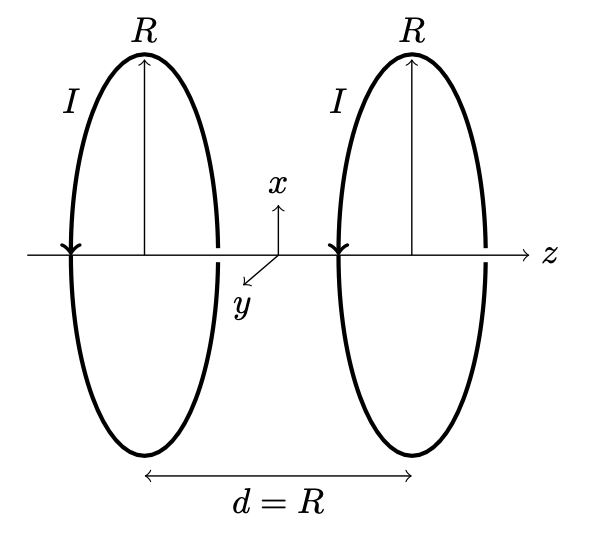

# Helmholtz-Coils

Python module to calculate the magnetic field of Helmholtz coils, anti Helmholtz coils and current loops.

The file 'Helmholtz Coils Theory.pdf' describes the formulas and methods used to calculate the magnetic field. Closed formulas exist for fields on the symmetry axis. However, in the general case, the expressions contain elliptic integrals. These elliptic integrals can efficiently calculated using the scipy module.

The file 'HelmholtzCoil.py' is the main modules. Functions starting with FieldXXX calculate the field without the factor mu0*I/(2*R). Functions starting MagneticFieldXXX calculate magnetic fields in units of Tesla. mu0*I/(2*R)*FieldXXX

The Jupyter notebook demonstrates the usage of 'HelmholtzCoil.py' and tests the correct implementation.

## ToDo

Add example notebooks

Improve the testing

## 

